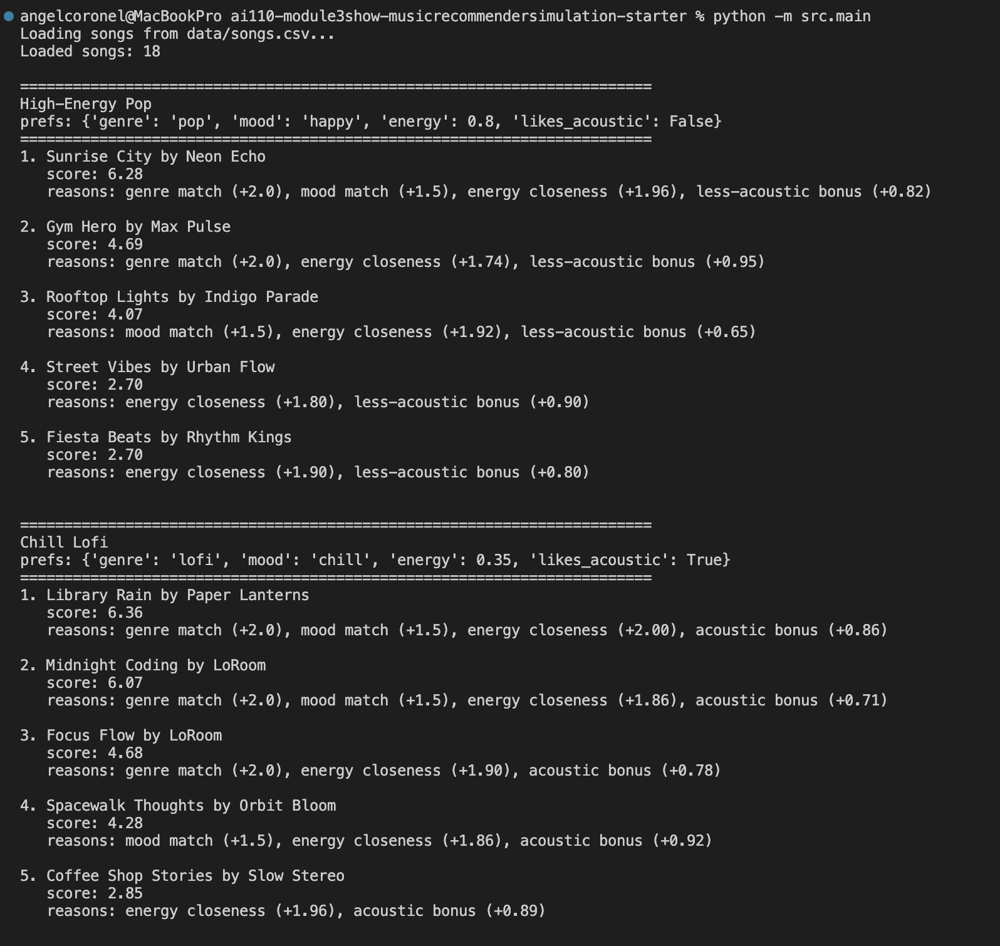
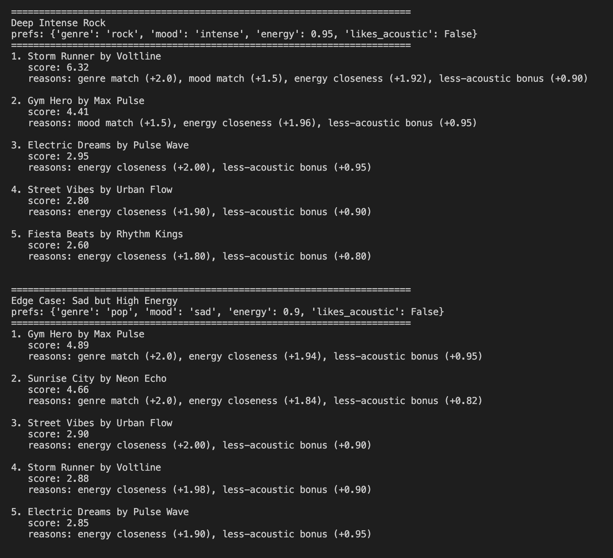
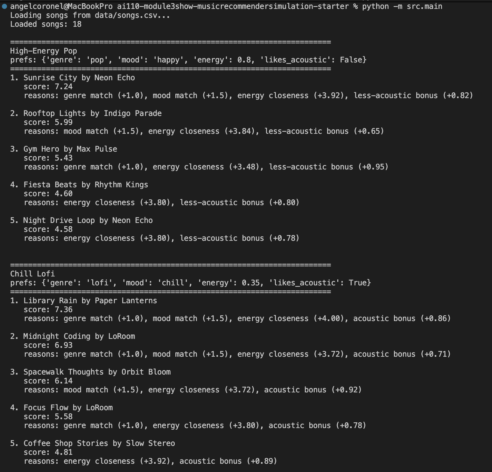
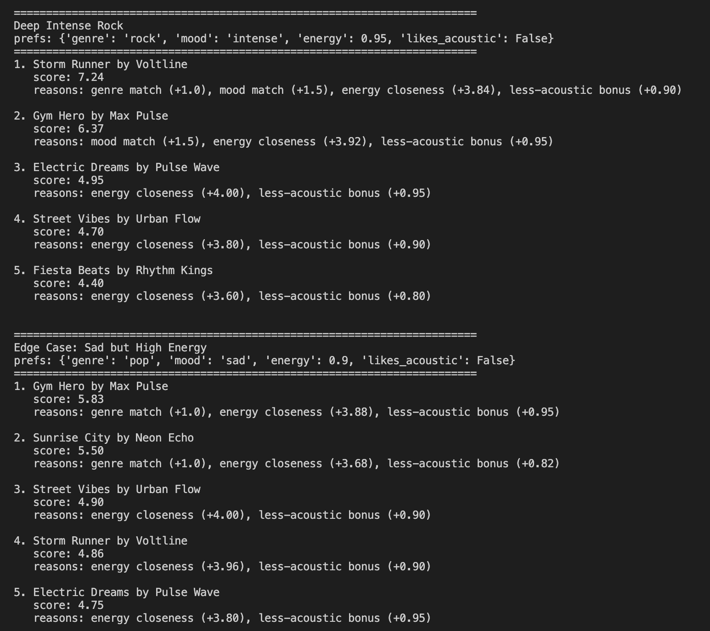

# 🎵 Music Recommender Simulation

## Project Summary

This project simulates a small content-based music recommender. My version uses song attributes like genre, mood, energy, and acousticness to compare each track against a user taste profile. It gives every song a weighted score, ranks the catalog from highest to lowest, and returns the top recommendations with short explanations for why each song matched.

---

## How The System Works

Real recommendation systems often use both user behavior and content features to predict what someone may like next. My version is a simple content-based recommender, so it only looks at song attributes and user preferences instead of using data from other listeners.

The recommender gives each song points for matching genre and mood, then adds a similarity score based on how close the song's energy is to the user's target. It also adds a small bonus or penalty based on acousticness. After scoring every song, it sorts them from highest to lowest and returns the top results.

Algorithm recipe:
- +2.0 for genre match
- +1.5 for mood match
- up to +2.0 for energy closeness
- up to +1.0 based on acousticness preference

This design is easy to understand, but it may over-prioritize genre and may miss songs that feel right for a user in more subtle ways.

### Planned User Profile

Example profile:

```python
{
    "favorite_genre": "lofi",
    "favorite_mood": "chill",
    "target_energy": 0.35,
    "likes_acoustic": True
}
```

Planned Song features:
- genre
- mood
- energy
- tempo_bpm
- valence
- danceability
- acousticness

Planned UserProfile features:
- favorite_genre
- favorite_mood
- target_energy
- likes_acoustic

Mermaid representation of data flow:
```mermaid
flowchart TD
    A[User Preferences] --> B[Load Songs]
    B --> C[Score Each Song]
    C --> D[Rank Songs]
    D --> E[Return Top K Recommendations]


---

## Getting Started

### Setup

1. Create a virtual environment (optional but recommended):

   ```bash
   python -m venv .venv
   source .venv/bin/activate      # Mac or Linux
   .venv\Scripts\activate         # Windows

2. Install dependencies

```bash
pip install -r requirements.txt
```

3. Run the app:

```bash
python -m src.main
```

### Running Tests

Run the starter tests with:

```bash
pytest
```

You can add more tests in `tests/test_recommender.py`.

---

## Experiments You Tried

- I tested the recommender with multiple profiles: High-Energy Pop, Chill Lofi, Deep Intense Rock, and an edge-case profile with sad mood but high energy.
- The strongest results were for clear profiles like High-Energy Pop and Chill Lofi because the genre, mood, and energy preferences lined up well.
- I also ran a small experiment by lowering the genre weight and increasing the energy weight. This made the recommendations more sensitive to energy and a little more varied, but it also made the system feel less tied to the user's stated genre preference.

### CLI Screenshots

#### Original scoring results




#### Weight-change experiment




---

## Limitations and Risks

This recommender only works on a small catalog of 18 songs, so its suggestions are limited by the dataset. It does not consider lyrics, listening history, artist loyalty, or context like time of day or activity. It can also over-favor genre matches, which may reduce variety and create a small filter bubble.

---

## Reflection

High-Energy Pop vs Chill Lofi:
The pop profile preferred louder, more upbeat songs with higher energy and less acousticness. The chill lofi profile shifted toward softer, lower-energy, and more acoustic songs. This makes sense because the energy target and acoustic preference changed a lot.

High-Energy Pop vs Deep Intense Rock:
Both profiles liked high-energy songs, so there was some overlap in energetic tracks. The difference is that the rock profile should push rock songs higher, while the pop profile favors upbeat pop songs. This shows that genre helps separate users even when their energy preferences are similar.

Chill Lofi vs Deep Intense Rock:
These profiles produced very different results. Chill lofi favored calm and acoustic tracks, while intense rock favored louder and more aggressive songs. This makes sense because the profiles differ in genre, mood, energy, and acoustic preference.

High-Energy Pop vs Sad but High Energy:
This comparison was interesting because both profiles liked high-energy songs, but the mood preference changed. That means some energetic songs still ranked well even when the emotional tone did not fully match. This shows that the recommender can be pulled in two directions when a profile has conflicting traits.